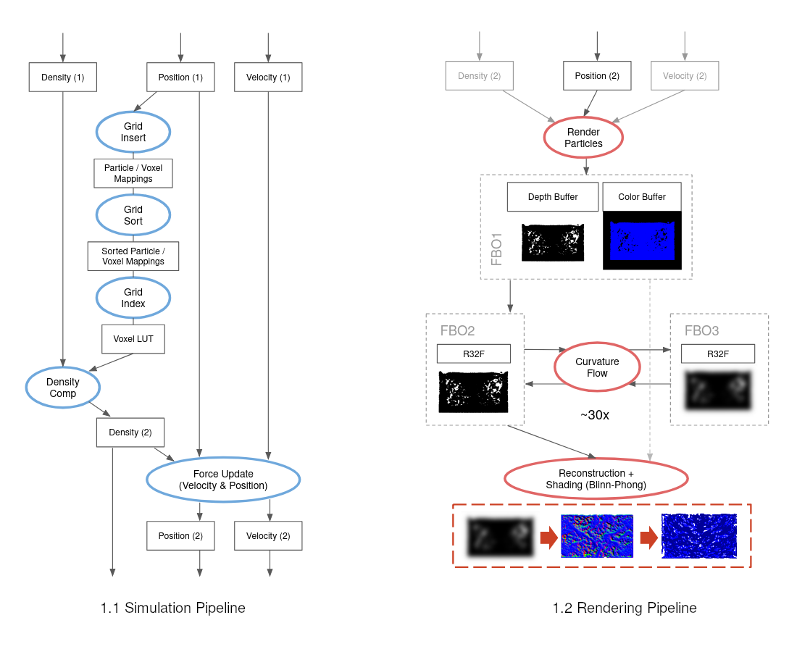

## flut

GPU-based fluid simulation and rendering using OpenGL 4.6 compute shaders, DSA and bindless textures. Fluid behaviour is simulated using _smoothed-particle hydrodynamics_ (SPH) as described by Müller et al. [1]. The GPU simulation pipeline roughly follows the work of Harada et al. [2]. After particle simulation, a screen-space rendering technique is performed to suggest a fluid-like continuous surface [3].  

[1] Particle-Based Fluid Simulation for Interactive Applications, Müller et al. 2003  
[2] Smoothed Particle Hydrodynamics on GPUs, Harada et al. 2007  
[3] Screen Space Fluid Rendering with Curvature Flow, van der Laan et al. 2009  

#### Simulation Pipeline Overview



#### Build

This project uses CMake for generating buildsystem files and Git submodules for dependency tracking. Make sure you `git clone` with the `--recursive` flag or execute `git submodule update --init --recursive` after a non-recursive clone.  
Then, invoke CMake for your buildsystem of choice and build the `flut` target.  
  
Example:
```sh
mkdir -p build && cd build
cmake .. -G "Visual Studio 15 2017 Win64" -DCMAKE_BUILD_TYPE=Release
cmake --build . -j 8 --target flut --config Release && ./bin/flut
```

#### Future Improvements

- Update README and pics to reflect new uniform grid building
- Better boundary handling with density contribution
- NxNxN workgroups with shared mem caching for neighborhood searches
- Replace curvature flow with better visualization method
- Implement surface tension forces
- Use coarse 3d velocity texture with HW filtering
